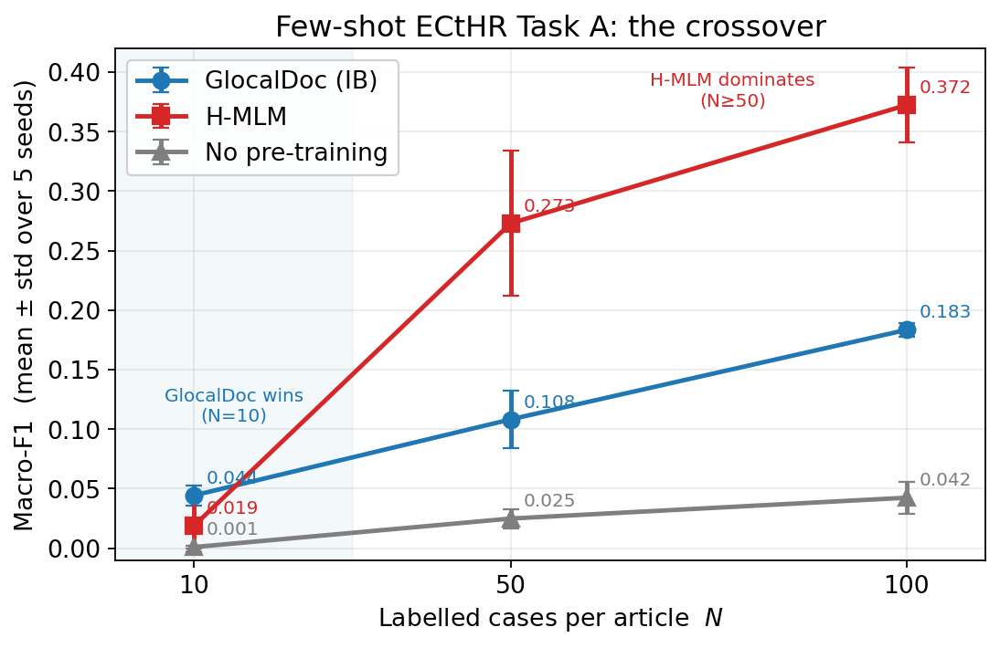
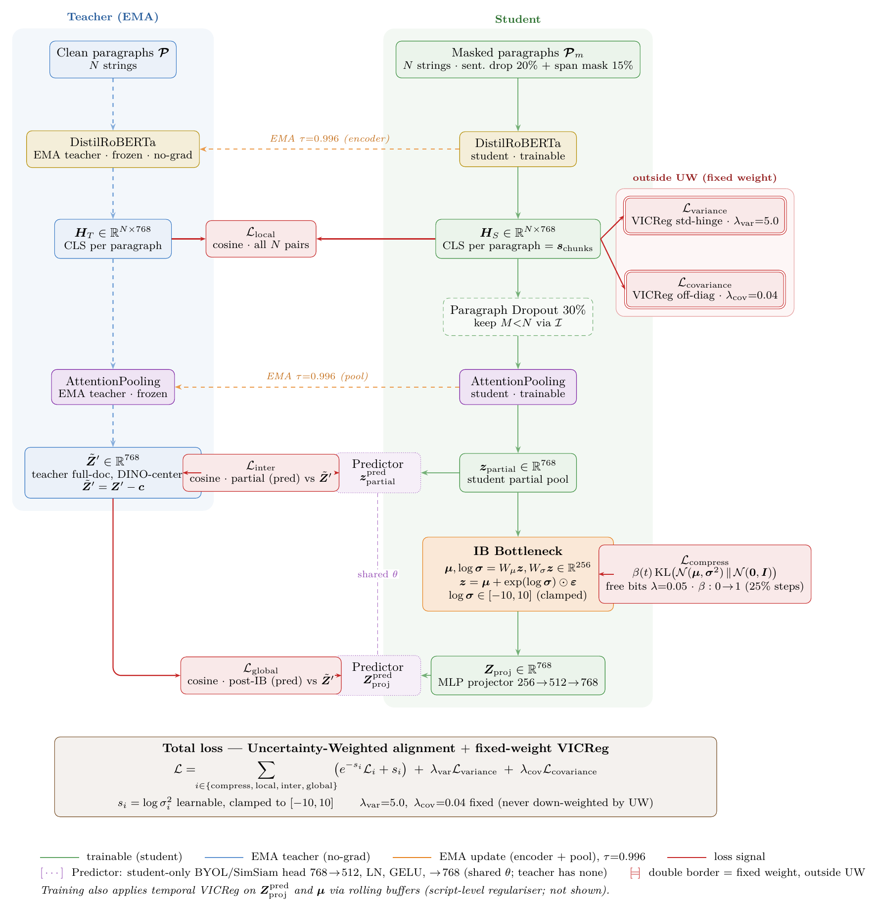
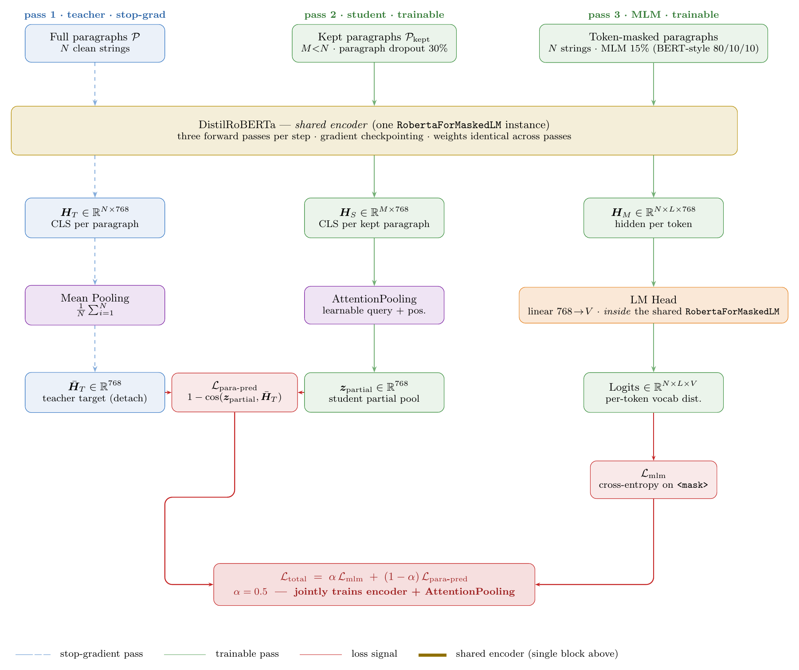
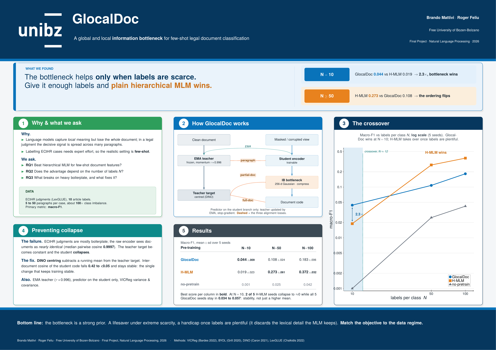

# GlocalDoc

> **A Global and Local Information Bottleneck for Few-Shot Legal Document Representation**

<p>
  
  
  
  
  
  
</p>

Modern encoders capture **local** meaning beautifully but lose track of a document as a
**whole** — a real problem for long, structured texts like court judgments, where the
decisive signal is spread across dozens of paragraphs. **GlocalDoc** is a pre-training
framework that squeezes a corrupted, partially-observed document through an explicit
**information bottleneck** while aligning it to a momentum **teacher** at three
granularities (paragraph, partial-document, full-document). The question: *does a more
global, compressed representation transfer better when labels are scarce?*

We test it on few-shot multi-label classification of **European Court of Human Rights**
cases and compare against a hierarchical masked-language-model baseline (**H-MLM**) and an
unpretrained baseline.

---

## TL;DR — what we found

**The advantage is regime-dependent, and the honest answer is "it depends on `N`."**



*Macro-F1 vs `N` over 5 seeds: GlocalDoc (blue) leads at `N=10`; H-MLM (red) overtakes from `N=50`. Neither wins everywhere.*

- **Wins at `N=10`.** GlocalDoc has the best macro-F1 and — more importantly — the **lowest
  variance across seeds**. H-MLM returns ~0 (0.000 and 0.001) on 2 of 5 seeds there: it fails
  to learn on those runs. The bottleneck behaves like a **strong prior** that pays off under scarcity.
- **Ordering flips at `N≥50`.** Once a moderate amount of supervision is available,
  **H-MLM dominates** and widens the gap at `N=100`. The same compression that helped early
  now discards lexical detail a linear head could otherwise exploit.
- **Both beat "no pre-training"** everywhere, so the effect comes from the objective, not the
  architecture or the optimizer.
- ⚠️ We also document and fix a **representational collapse** specific to boilerplate-heavy
  legal text (median inter-document cosine of **0.9997** in the raw encoder): **DINO-style
  centering of the teacher target** is the decisive fix.

> 📄 Full write-up: **[`paper/main.pdf`](paper/main.pdf)** · 🖼️ A0 poster: **[`doc/poster.pdf`](doc/poster.pdf)**

---

## The idea

A European Court of Human Rights (ECtHR) judgment states its facts across dozens of numbered
paragraphs, and the allegedly-violated articles depend on how those paragraphs *interact*.
Annotation is expensive and expert, so the realistic setting is **few-shot**. A
representation that already encodes the global *shape* of a document — before any task labels
— should transfer better than one tuned only for token-level prediction.

We instantiate the **information bottleneck** principle for documents and ask three questions:

- **RQ1.** Does global+local bottleneck pre-training yield better few-shot features than
  hierarchical masked language modelling?
- **RQ2.** How does any advantage depend on the amount of supervision at fine-tune time?
- **RQ3.** What instabilities does the objective introduce on a boilerplate-heavy corpus, and
  which mechanisms resolve them?

---

## How GlocalDoc works

A document is split into paragraphs; each is encoded independently by a shared
**DistilRoBERTa** (`[CLS]` per paragraph), then composed by a learnable **attention pooler**
(initialized to exact mean pooling). Training is a two-branch, non-contrastive
teacher–student scheme with an information bottleneck on the student side.



- **Teacher (EMA).** A frozen exponential-moving-average copy (τ = 0.996) of the student
  encoder + pooler reads the **clean** document and produces the full-document target. The
  target is **DINO-centered** (`Z̃' = Z' − c`) to strip the constant boilerplate direction.
- **Student (trainable).** Reads a **masked** view (20 % sentence dropout + 15 % span
  masking), drops 30 % of paragraphs at the pooling stage, then compresses the partial pool
  through a stochastic **IB bottleneck** (256-d, reparameterization trick) and projects back
  to ℝ⁷⁶⁸.
- **Three alignment losses** (cosine): `L_local` matches every student paragraph vector to the
  teacher's; `L_inter` and `L_global` regress the partial pool and the compressed code onto
  the centered teacher target.
- **Anti-collapse, four ways.** A student-only **BYOL/SimSiam predictor** (the asymmetry that
  removes the constant-output fixed point), the EMA teacher, **VICReg** variance + covariance
  hinges (kept *outside* the weighting so they can never be down-weighted), and DINO centering.
- **Compression.** `L_compress` is a β-warmed-up, **free-bits-floored** (λ = 0.05 nats/dim) KL
  to a standard normal prior.
- **Balancing.** The four alignment-family losses are combined by **homoscedastic uncertainty
  weighting** (learned log-variances on their own high-LR parameter group); the VICReg terms
  use fixed weights.

The exact schedule and coefficients (β warm-up, EMA rate, free-bits budget, VICReg weights) are
in the paper's configuration table (Appendix C).

### H-MLM baseline

H-MLM keeps the **same backbone, paragraph encoding, and attention pooler**, and removes
everything GlocalDoc-specific. It is hierarchical in the spirit of SMITH: token-level masked
prediction per paragraph (`L_mlm`) plus a single pooling objective that reconstructs the
full document from a 70 % subset (`L_para-pred`), weighted 0.5 / 0.5. No bottleneck, no
teacher, no predictor. This makes the comparison a **clean test of the pre-training objective**
under an identical architecture and fine-tuning procedure.



---

## Results

Few-shot test results on **ECtHR Task A** (LexGLUE). Mean over 5 seeds, standard deviation in
parentheses. **Macro-F1 is the primary metric** (label imbalance is ~100×). Bold = best method
at that `N`.

| `N` | Method | Macro-F1 | Micro-F1 |
|:---:|:-------|:--------:|:--------:|
| **10**  | **GlocalDoc**       | **0.044** (0.009) | **0.139** (0.045) |
|         | H-MLM               | 0.019 (0.023)     | 0.069 (0.085)     |
|         | No pre-training     | 0.001 (0.001)     | 0.003 (0.004)     |
| **50**  | **H-MLM**           | **0.273** (0.061) | **0.354** (0.060) |
|         | GlocalDoc           | 0.108 (0.024)     | 0.224 (0.027)     |
|         | No pre-training     | 0.025 (0.008)     | 0.077 (0.030)     |
| **100** | **H-MLM**           | **0.372** (0.032) | **0.454** (0.030) |
|         | GlocalDoc           | 0.183 (0.006)     | 0.306 (0.014)     |
|         | No pre-training     | 0.042 (0.013)     | 0.106 (0.019)     |

*In the code and `results/finetuning_results.json` the conditions are keyed `glocal_ib`, `h_mlm`, and `no_pretrain`.*

The most informative quantity at `N=10` is the **variance**, not the mean: GlocalDoc's per-seed
macro-F1 stays in a tight band (**0.035–0.057**), while H-MLM swings from **0.000 to 0.054** —
near-zero on 2 of 5 seeds. A method that fails on 40 % of seeds is not usable when you cannot
afford many annotation rounds, so on that axis GlocalDoc is clearly preferable even where the
mean gap is small.

Raw numbers live in [`results/finetuning_results.json`](results/finetuning_results.json);
per-seed scores and the training-dynamics figure are in the paper (Appendix D and Fig. 3).

---

## Repository layout

```
GlocalDoc/
├── src/                       # the library
│   ├── data.py                #   ECtHR loading, two-level masking, few-shot sampling
│   ├── model.py               #   GlocalIBModel, AttentionPooling, DocumentClassifier
│   └── loss.py                #   glocal_ib_loss + VICReg / KL / alignment terms
├── scripts/                   # standalone, SSH/cluster-friendly entry points
│   ├── 00_probe_doc_diversity.py   #   measures the 0.9997 inter-doc cosine
│   ├── 01_data_exploration.py      #   dataset stats + paragraph-count histogram
│   ├── 02_pretrain_glocal.py       #   GlocalDoc pre-training (accelerate)
│   ├── 03_pretrain_mlm.py          #   H-MLM pre-training (accelerate)
│   └── 04_finetune.py              #   fine-tune all conditions × N × seeds
├── slurm/                     # SLURM submission scripts for a cluster
├── paper/                     # IEEE paper: main.tex + bibliography.bib, and compiled main.pdf
├── doc/
│   ├── poster.pdf / poster.tex             #   A0 conference poster + source
│   ├── preview.png                         #   poster preview (shown below)
│   ├── glocalDoc_architecture.pdf / .tex   #   GlocalDoc architecture figure + source
│   ├── H-MLM.pdf / hmlm_architecture.tex   #   H-MLM architecture figure + source
│   ├── figures/                            #   PNG renders embedded in this README
│   └── assets/                             #   logos / QR for the poster build
├── results/                   # finetuning_results.json + document-diversity probe
├── requirements.txt
└── README.md
```

---

## Setup

```bash
# Python 3.10 environment
conda create -n glocal_nlp python=3.10
conda activate glocal_nlp

# PyTorch (CUDA 12.1 build; drop pytorch-cuda for CPU-only)
conda install pytorch torchvision torchaudio pytorch-cuda=12.1 -c pytorch -c nvidia

pip install -r requirements.txt
```

The ECtHR data (`coastalcph/lex_glue`, config `ecthr_a`) is downloaded automatically from the
🤗 Hub on first use. Experiment tracking uses Weights & Biases (project `glocal-nlp`); set
`WANDB_MODE=offline` to disable.

### Quick sanity check (CPU, no GPU)

Verifies the full GlocalDoc forward **and** backward pass wires up correctly:

```python
import torch
from src.model import GlocalIBModel
from src.loss import glocal_ib_loss
from src.data import mask_text, get_paragraph_mask

model = GlocalIBModel(device="cpu")
full          = [["Para A.", "Para B.", "Para C.", "Para D."]]
masked_batch  = [[mask_text(p) for p in doc] for doc in full]   # ALL N paragraphs, word-masked
kept_indices  = [get_paragraph_mask(len(doc)) for doc in full]  # paragraph dropout at pooling

out = model(full, masked_batch, kept_indices)   # 10-tuple
total, *_ = glocal_ib_loss(*out[:8])            # loss consumes the first 8
total.backward()
print("GlocalIB OK", total.item())
```

---

## Reproducing the experiments

All commands assume `conda activate glocal_nlp` and are run from the repository root.

```bash
# 0. (optional) Probe document homogeneity — reproduces the 0.9997 inter-doc cosine
python scripts/00_probe_doc_diversity.py

# 1. Explore the data (prints stats, saves a histogram to results/)
python scripts/01_data_exploration.py

# 2. Pre-train GlocalDoc  (single 32 GB GPU: BATCH_SIZE=1, GRAD_ACCUM=8, bf16)
accelerate launch --num_processes=1 scripts/02_pretrain_glocal.py

# 3. Pre-train the H-MLM baseline  (single 32 GB GPU: BATCH_SIZE=1, GRAD_ACCUM=4, bf16)
accelerate launch --num_processes=1 scripts/03_pretrain_mlm.py

# 4. Fine-tune every condition × N∈{10,50,100} × 5 seeds → results/finetuning_results.json
python scripts/04_finetune.py
```

**Multi-GPU** (e.g. 4× A100): pass `--num_processes=4` to the `accelerate launch` commands.

**On a SLURM cluster:** ready-made jobs live in [`slurm/`](slurm/). Before submitting, edit the
`cd /path/to/GlocalDoc` line in each script to your cluster path and confirm the partition name
with your admin.

| Job | Recommended hardware | Batch config |
|-----|----------------------|--------------|
| GlocalDoc pre-training | 1× 32 GB GPU (Ampere+) | `BATCH_SIZE=1`, `GRAD_ACCUM=8`, bf16 |
| H-MLM pre-training | 1× 32 GB GPU (Ampere+) | `BATCH_SIZE=1`, `GRAD_ACCUM=4`, bf16 |
| Fine-tuning / exploration | 1× 32 GB GPU | one example per step |
| Sanity checks | CPU | no GPU required |

> 12 GB cards (e.g. TITAN Xp, no bf16): use `fp16` and `GRAD_ACCUM=4`. Gradient checkpointing
> already uses `use_reentrant=False`, so the fp16 + GradScaler path is safe.

---

## Paper & poster

|  |  |
|---|---|
| 📄 **Paper** | [`paper/main.pdf`](paper/main.pdf) — IEEE-format write-up (source: [`paper/main.tex`](paper/main.tex)) |
| 🖼️ **Poster** | [`doc/poster.pdf`](doc/poster.pdf) — A0 conference poster |

[](doc/poster.pdf)

---

## Citation

```bibtex
@misc{mattivi2026glocaldoc,
  title  = {GlocalDoc: A Global and Local Information Bottleneck for
            Few-Shot Legal Document Representation},
  author = {Mattivi, Brando and Feliu, Roger},
  year   = {2026},
  note   = {Final Project, Natural Language Processing,
            Free University of Bozen-Bolzano},
}
```

## Authors

**Brando Mattivi · Roger Feliu** — Free University of Bozen-Bolzano
Final Project · Natural Language Processing · 2026
